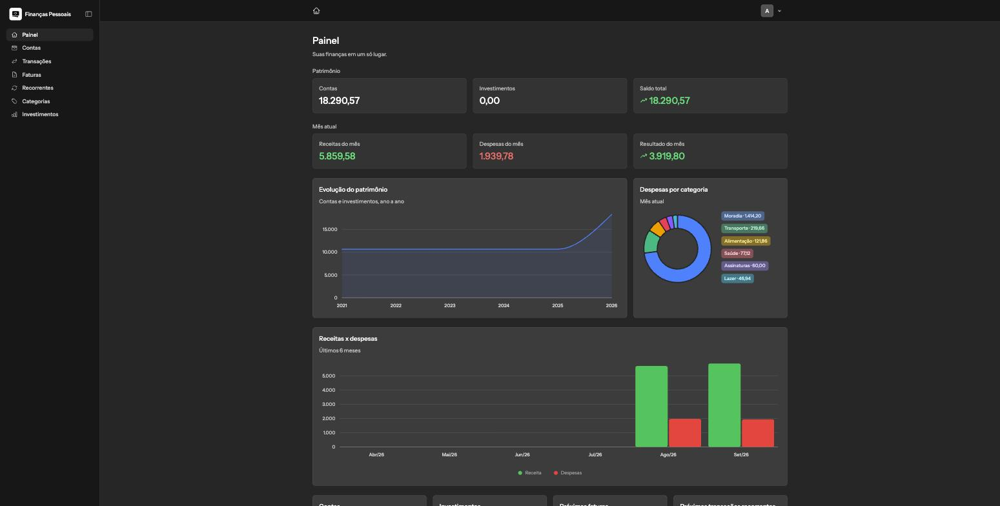

# Finanças Pessoais

[](https://github.com/rmonte/financas-pessoais/actions/workflows/tests.yml)



Aplicativo de finanças pessoais construído com Laravel e Livewire: contas multi-moeda, transações, faturas de cartão de crédito com parcelamento, transações recorrentes e um módulo de investimentos (ações, Tesouro Direto, previdência e renda fixa).

## Recursos

- **Contas**: múltiplas contas em BRL/USD, incluindo cartões de crédito com dia de fechamento/vencimento.
- **Transações**: receitas, despesas, transferências entre contas e parcelamento automático.
- **Faturas**: geração automática por ciclo de fatura, pagamento vinculado a uma transação de transferência.
- **Recorrências**: regras de receita/despesa/transferência que geram as transações automaticamente (via comando agendado).
- **Investimentos**: ações, Tesouro Direto, previdência e renda fixa, com operações que podem gerar uma transação vinculada à conta bancária usada.
- **Dashboard**: visão de patrimônio, evolução por ano, receitas x despesas e próximos vencimentos.
- **Segurança**: autenticação com 2FA (TOTP) e passkeys (WebAuthn) via Laravel Fortify.
- **Interface**: em português (pt-BR), construída com [Livewire](https://livewire.laravel.com) e [Flux UI](https://fluxui.dev).

## Stack

PHP 8.5 · Laravel 13 · Livewire 4 · Flux UI Pro · MySQL · Pest.

> [!IMPORTANT]
> Este projeto usa o **[Flux UI Pro](https://fluxui.dev)**, uma biblioteca de componentes paga. Ela é necessária para rodar a aplicação — sem uma licença, o `composer install` não consegue baixar o pacote `livewire/flux-pro`. Veja a seção [Licença do Flux UI Pro](#licença-do-flux-ui-pro) abaixo antes de continuar.

## Como rodar

### Com Docker (recomendado)

O projeto já vem configurado com [Laravel Sail](https://laravel.com/docs/sail), que sobe a aplicação, o MySQL e o [Mailpit](https://github.com/axllent/mailpit) (para inspecionar e-mails localmente) com um único comando.

Pré-requisitos: [Docker](https://www.docker.com/) instalado e uma licença do Flux UI Pro (veja abaixo).

```bash
git clone https://github.com/rmonte/financas-pessoais.git
cd financas-pessoais
cp .env.example .env

# autentique o Composer para o repositório privado do Flux Pro
composer config http-basic.composer.fluxui.dev "seu-email@exemplo.com" "sua-license-key"

composer install
php artisan key:generate

npm install

./vendor/bin/sail up -d
./vendor/bin/sail artisan migrate
./vendor/bin/sail artisan db:seed   # opcional: cria um usuário e dados de demonstração
./vendor/bin/sail npm run dev
```

A aplicação fica disponível em `http://localhost:8000`, e o Mailpit em `http://localhost:8025`.

Usuário criado pelo seed (ajustável via `SEED_ADMIN_EMAIL`/`SEED_ADMIN_PASSWORD` no `.env`):

```
E-mail: admin@example.com
Senha: password
```

### Sem Docker

Também é possível rodar nativamente, com PHP 8.5, Node.js e um MySQL próprio instalados:

```bash
cp .env.example .env
# edite o .env: DB_HOST=127.0.0.1 e as credenciais do seu MySQL

composer config http-basic.composer.fluxui.dev "seu-email@exemplo.com" "sua-license-key"
composer install
php artisan key:generate

npm install
php artisan migrate
php artisan db:seed

composer run dev
```

O comando `composer run dev` sobe o servidor, o worker de filas, o log em tempo real (Pail) e o Vite juntos.

## Licença do Flux UI Pro

O Flux UI Pro é distribuído pela [fluxui.dev](https://fluxui.dev/pricing) e exige uma licença própria para ser instalado — ela **não** está incluída neste repositório nem é coberta pela licença MIT deste projeto. Depois de comprar uma licença, autentique o Composer uma única vez por ambiente:

```bash
composer config http-basic.composer.fluxui.dev "seu-email@exemplo.com" "sua-license-key"
```

Isso cria um `auth.json` local (já ignorado pelo git) com as suas credenciais. Mais detalhes na [documentação oficial de instalação](https://fluxui.dev/docs/installation).

## CI

O workflow em `.github/workflows/tests.yml` roda os testes a cada push/PR na `main`, contra um serviço MySQL. Para funcionar no seu fork, configure em **Settings → Secrets and variables → Actions** os secrets `FLUX_USERNAME` (seu e-mail da Flux) e `FLUX_LICENSE_KEY` (sua license key) — sem eles, o `composer install` do CI falha ao tentar baixar o Flux Pro.

## Testes

```bash
./vendor/bin/sail artisan test      # com Sail
php artisan test                    # sem Sail
```

Rodar apenas os arquivos/formatos alterados:

```bash
./vendor/bin/sail artisan test --filter=NomeDoTeste
```

Formatação de código (Pint):

```bash
./vendor/bin/sail bin pint --dirty
```

## Licença

O código deste projeto está sob a licença [MIT](LICENSE). O Flux UI Pro é um produto separado, com sua própria licença comercial.
